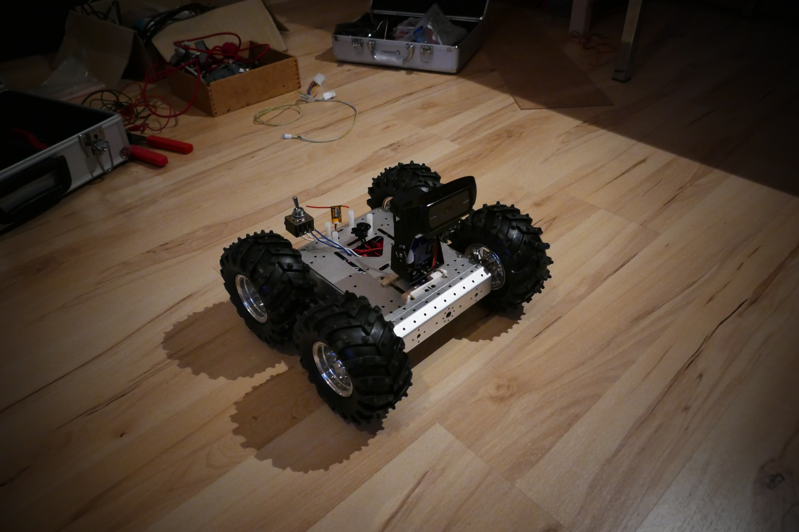

:toc: left
:author: Kjell Morgenstern <kjell@gmx.de>

== Features

* Remote control via DSMX
* Steer motors via ESC
* Motor left right mixer for intuitive driving
* Camera streaming via WLAN
* Enable / disable camera with the remote control
* Move camera (pan and tilt) with the remote control
* Arm / disarm via remote. If the remote is switched off or unarmed, no movement will happen
* Battery management, LiPo battery can be charged without removing

== Demonstration

.Robot on table, demonstration of wheel movement, camera movement, and camera enable/ disable
video::244259422[vimeo,width=600,height=920]

.Robot on ground, demonstration of driving, camera movement and camera disable / enable. Remote control visible.
video::244259496[vimeo,width=600,height=920]

== Document History

|===
| v0.1 | 2017-11-23 | Initial document |
|===
